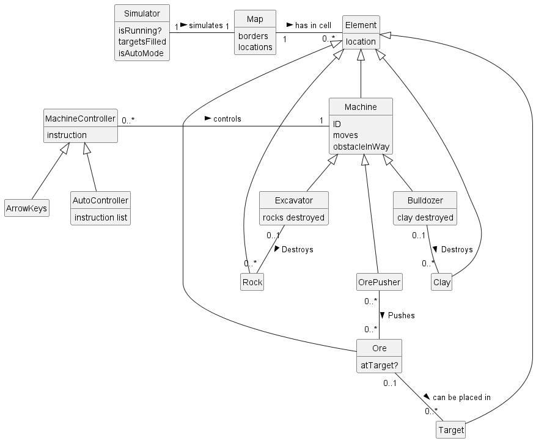
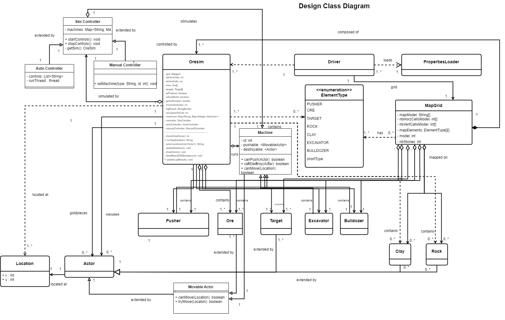
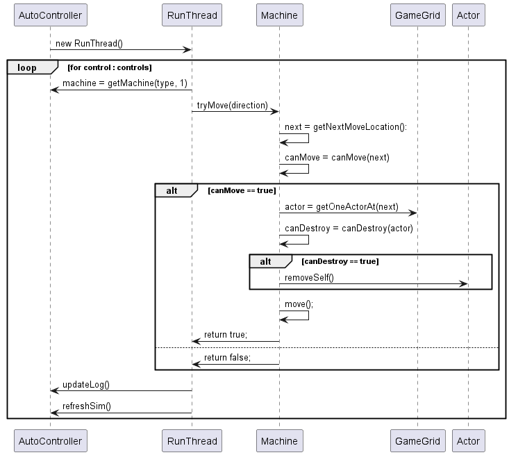

## Analysis of the Current Design

### Inner Classes 

The biggest issue present in the original codebase is the inner classes in `OreSim`. These inner classes cause a high level of coupling and low cohesion, as it left `OreSim` to handle all responsibilities, and made it difficult for classes to interact with each other without also interacting with `OreSim`

### Element Type Enum

The `ElementType` enum that is used creates an extra layer of indirection that is unnecessary and results in extra coupling between modules. Modules use the enum as a reference to classes rather than the actual classes themselves. This means that every time a new element is added, the enum needs to be modified, and any sections of code that depend on the enum need to be changed to add the check for the extra option. This violates the Protected Variation principle, since there doesn't exist a stable interface. 

### Movement

`OreSim` is responsible for checking whether an object can move, however the property of whether a machine or obstacle can move can very between machine to machine and obstacle to obstacle, so only those objects would have the information whether they can move to a cell. Extending this design without changing where the responsibilities lie would require `OreSim` to have multiple conditional statements depending on the object type to determine whether it can move, requiring the logic of the existing code to be modified every time a new element is added.

### Machines

It's clear that Ore Pushers, Excavators, and Bulldozers are all machines that get operated in the same way, yet the original Ore Sim has these as separate classes that inherit from `Actor`. Whilst `Actor` does implement a lot of shared functionality, it does not implement some of the shared logic that would need to be implemented, such as checking movement into borders or obstacles that can't be pushed or destroyed. Not having a parent class that implements this logic would result in a lot of code duplication if new machines are to be added.

### Obstacles

A similar argument could potentially be made for obstacles, however, besides being an actor, they do not really have any shared functionality. Unless the simulator requires more functionality in regard to destroying objects in the future, the `Actor` class is sufficient.

### Controllers

The original way `OreSim` handles different operational modes is through different methods, `autoMoveNext()` in the `Pusher` inner class, and `keyPressed` in `OreSim`. Having the methods split up violates the information expert pattern, in turn increasing coupling and decreasing cohesion. A pressed key may not necessarily lead to only one pusher moving or a pusher moving at all; and a machine may move without a button being pressed. These are separate responsibilities and having them handled as one makes it difficult to adhere to business rules and extensions without code duplication.

## Solutions and Implementations

An important aspect to consider when refactor the codebase is the Open-Closed principle and Protected Variation. Since OreSim needs to be extensible with new features, the addition of these features should not affect or break the existing interface. This means that any methods used by other classes should not need to be changed to add this functionality. This is especially important since as the simulator expands, certain business rules may change, and while logic should change, the interface should not.

### Inner Classes

To increase cohesion, `OreSim` would need to be split into distinct modules. These would modules for machines, obstacles, and controllers for the simulator. Each of these modules has a distinct responsibility and hence high cohesion, and minimises coupling of classes.

### Element Type Enum

The enum can be replaced by changing how `MapGrid` works. Instead of populating the 2D array with instances of `ElementType` then creating the objects in OreSim, the objects can be created in and directly populated in the map grid. `OreSim` could then directly be instantiated without having to refer to `ElementType` to do so. This would remove the dependency that the classes have on the enum and reducing coupling. To ensure that the map grid only populates valid elements, the enum can be replaced with an interface, which would primarily be used as a marker. The interface would also allow each element to define how each element needs to be instantiated on a grid, removing that responsiblity from `OreSim`, adhering to the Information Expert principle.

However, since the testing depends on the enum, this change could not have been made.

### Movement

All objects on the map grid that can move have to adhere to certain set of rules; they can't move into the border, nor can they move to a cell occupied by another obstacle unless they can push or destroy it. This was realised through a base abstract class `MovableActor` that defines `protected boolean canMove()` and `public boolean tryMove()`. This provides a single interface to moving an object, whilst allowing each object that inherits it to modify their rules of movement if required. As a result, it reduces coupling as other classes such as `OreSim` do not need to know the conditions for which an actor can move, only that it tries to move and knows if that move was successful.

As a result, when adding any new machines or obstacles, they can define their rules of movement without having to modify existing code, adhering to the Open-Closed principle.

### Machines

The shared functionality between machines can be extracted into an abstract `Machine` parent class to create a unified interface for operating all machines whilst allowing each machine implementation to manage extra rules that they may have. It was determined that machines need the ability to move, as well as push and destroy objects. This allowed each subclass of `Machine` to define the objects that it can push and destroy, without having to repeat any logic when it comes to movement, pushing, or destroying the objects. All pushable objects have to extend `MovableActor`, ensuring that they have a unified interface to moving (and hence being pushed), and all destroyable objects extend `Actor`, as that is sufficient to destroy them. If any new machines require additional functionality, this could then be defined in the subclass implementation without having to modify existing code.

The implementation also allowed each machine to be able to track all the objects that it destroyed, which was needed by the statistics tracker. 

### Obstacles

As mentioned, as per the current problem domain, it is sufficient for obstacles to remain as 'Actor' children. However, another `Obstacle` class could be defined for any shared functionality that may need to be implemented.

### Controllers

Through the use of polymorphism, the interface for any controller can be kept the same, adhering to the protected variation principle. This would allow `OreSim` to use any controller that extends the super class, as long as it can implement the super class's abstract methods. As a result, the only thing that would need to change in `OreSim` is the constructor and creation of the correct controller based off of the properties file, removing any conditional statements in its operation. This makes adding new options to control machines incredibly easy without having to modify `OreSim`'s operational logic, increasing cohesion as each controller is clearly responsible for a certain method to operate machines.  

The abstract class was realised as `SimController`, defining the interface of `void startControls()` and `void endControls()` to be used by `OreSim` before and after machine operation is required, respectively.

## Possible Implementations for Proposed Extensions

The interface multiple machines with different IDs used in the simulation and the stat tracker is already entirely implemented. The `drawActors` method in `OreSim` currently auto increments IDs for each machine of a type created, depending on the order they appear in the map string, adding them to a `TreeMap` with the ID as they key and a reference to the object as the value. The `TreeMap` supports the ability for different ways to generate IDs, whilst still allowing the machines to be accessed by the IDs' natural ordering for statistics printing. The statistics tracker can work with any number of machines and types, as long as they are defined as an `ElementType` and added to `machines` map in `OreSim`. The `machines` map uses a `LinkedHashMap` to allow the access of machine types in the order they were added, and as stated above, the map for each type of machine uses a `TreeMap` for ID ordered access.

Since the abstract `Machine` class supports the ability to push and destroy any selection of `MovableActor`s and `Actor`s respectively, subclasses can be created extend the `Machine` class, with their `super` constructors having the appropriate pushable and destroyable classes. New specific functionality for new machines can also be implemented with appropriate attributes and methods in the subclasses.

Additional obstacles can be implemented easily, all that is required is the creation of a new class that extends `MovableActor` if the obstacles moves or can be pushed, or just `Actor` if it cannot. These classes can then be used as arguments for any machines that interact with them. As for creating them in the simulator, they can be added to `OreSim.ElementType` as an enum option, where then the `MapGrid` class's constructor would need to add a case for creating the obstacles from the map string, and `OreSim`'s `drawActors()` method can populate them in the game grid. 

Through the use of the abstract `SimController` class, any new set of controls can be implemented by implementing a new subclass. As long as this class can implement the methods `void startControls()` and `void stopControls()`, it will be able to be used by `OreSim`. In the `OreSim` class, the constructor would need to handle creating the correct controller from the property file, but then the above methods should be able to handle adding/removing any event listeners required to operate. For example, a `JoystickController` class would need an event listener for joystick events, added when `startControls()` is run. An `AutonomousController` could be implemented by providing its constructor the locations of all actors, and its `startControls()` method could then generate optimal movement sequences apply them in the same way as the `AutoController` does.

